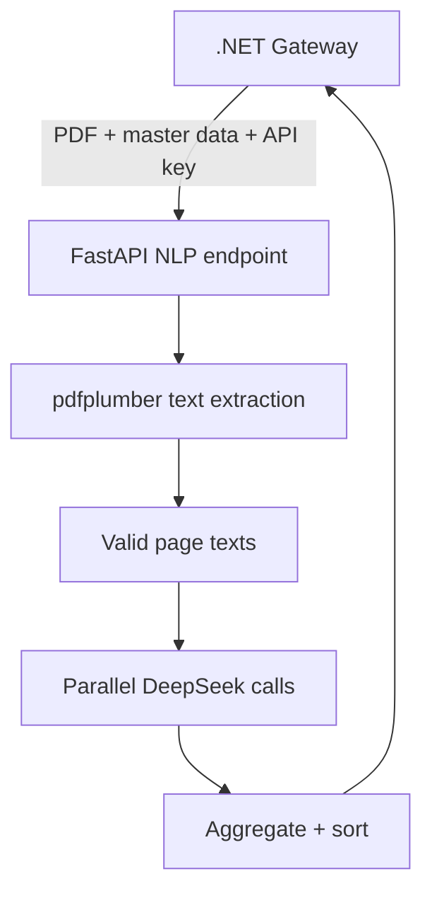

# Building the WalletApp Python AI/NLP Microservice from Scratch

> This is not a general Python or artificial intelligence course. It is a project-specific tutorial, aligned with the real commit history, for starting from an empty directory and rebuilding the FastAPI + DeepSeek PDF statement parser used by WalletApp.

## How to use this guide

If you forget Python, FastAPI, or the LLM integration months from now, you can follow this document from beginning to end. Every stage produces a small working piece: first a health endpoint, then PDF text extraction, a single-page LLM call, parallel multi-page processing, merchant/category context, security, Docker, and distributed tracing.

The project initially experimented with OpenCV + Tesseract OCR. That architecture was later removed completely in favor of the PDF's native text layer and an LLM-based NLP pipeline. That decision belongs in the guide because, when rebuilding the service, you should remember why those now-unnecessary OCR dependencies are not being installed.

## 1. Mental model of the final system



The .NET backend is the public-facing gateway. It checks file size and MIME type, attaches category and merchant master data, and calls the Python service with an internal API key. Python extracts the PDF text, sends each page separately to the LLM, and merges the returned transaction lists.

| File/component | Responsibility |
| --- | --- |
| `main.py` | Currently contains the API, configuration, security, extraction, LLM, and tracing code |
| `requirements.txt` | Python runtime dependencies |
| `.env` | Local secrets and configuration; never committed to Git |
| `Dockerfile` | Python slim image and Uvicorn process |
| `pdfplumber` | Native PDF text-layer extraction |
| `AsyncOpenAI` | OpenAI-compatible client used for DeepSeek |
| `contextvars` | Request-specific correlation ID in async execution |
| OpenTelemetry | Exports FastAPI request traces through OTLP |

---

# Stage 1 — Set up the Python environment and FastAPI skeleton

**Corresponding commit:** `552e29a Initial commit: setup FastAPI skeleton with health check endpoint`

```bash
mkdir WalletApp-Python-AI
cd WalletApp-Python-AI
python3 -m venv .venv
source .venv/bin/activate
python -m pip install --upgrade pip
pip install fastapi uvicorn python-dotenv
```

Activation in Windows PowerShell:

```powershell
.venv\Scripts\Activate.ps1
```

Initial `main.py`:

```python
from fastapi import FastAPI

app = FastAPI(title="FamilyFinance AI & NLP Service")


@app.get("/health")
async def health_check():
    return {"status": "active", "service": "FamilyFinance NLP Core"}
```

Run it:

```bash
uvicorn main:app --reload --port 8000
```

Verify it:

```bash
curl http://localhost:8000/health
```

`main:app` means the object named `app` inside the `main.py` module. `--reload` is only for development; it restarts the process whenever a source file changes.

`.gitignore`:

```gitignore
.venv/
venv/
__pycache__/
*.py[cod]
.env
.DS_Store
.idea/
.vscode/
```

**Checkpoint:** `/health` must return HTTP 200 and JSON.

---

# Stage 2 — Understand the first OCR attempt and why it was removed

**Corresponding commits:** `2ec8760 OpenCV image preprocessing and Tesseract OCR pipeline`; removal/pivot in `42fc4c8 remove all OCR and Vision dependencies`

The original idea was to clean receipt or scan images with OpenCV, apply thresholding and deskewing, and run Tesseract OCR. That is a valid solution for some documents. The target files here, however, were credit-card statement PDFs generated by banks and usually already contained a selectable text layer.

In that situation, OCR:

- Re-estimates text from pixels even though the PDF already contains more accurate text.
- Adds OpenCV, Tesseract, and operating-system language-data dependencies.
- Introduces new errors in Turkish characters, table alignment, and POS descriptions.
- Makes the Docker image and deployment more complicated.
- Increases CPU usage.

The OpenCV/Tesseract code and dependencies were therefore removed, and the project moved to native text extraction with `pdfplumber`. The architectural lesson is simple: the ability to use AI or OCR is not a reason to ignore structured data already present in the document. Use the most direct source first.

If scanned PDFs need to be supported later, introduce OCR as a fallback rather than the primary path:

1. Attempt text-layer extraction first.
2. If too little text is extracted, classify the document as scanned.
3. Only then route it to an isolated OCR worker.

---

# Stage 3 — PDF upload and native text extraction

**Corresponding commit:** Major NLP pivot in `6c7e54c`

Install the required packages:

```bash
pip install pdfplumber python-multipart
```

`python-multipart` is required for FastAPI to read `UploadFile`, `File`, and `Form` fields.

Initial endpoint:

```python
import io
import pdfplumber
from fastapi import FastAPI, File, UploadFile


@app.post("/api/nlp/parse-statement")
async def parse_statement(file: UploadFile = File(...)):
    pdf_bytes = await file.read()
    pages_text: list[str] = []

    with pdfplumber.open(io.BytesIO(pdf_bytes)) as pdf:
        for page in pdf.pages:
            extracted = page.extract_text()
            if extracted and len(extracted) > 50:
                pages_text.append(extracted)

    if not pages_text:
        return {
            "success": False,
            "message": "Could not extract text. PDF might be empty.",
        }

    return {"success": True, "page_count": len(pages_text)}
```

The flow is:

1. `UploadFile` receives the multipart file.
2. `await file.read()` reads its bytes.
3. `io.BytesIO` turns the byte array into a file-like object.
4. `pdfplumber.open` opens the PDF.
5. The text layer is extracted from every page.
6. Empty or extremely short pages are ignored.

`len(extracted) > 50` is the project's current practical heuristic for ignoring covers and empty pages; it is not a universal rule. It can later become configuration or a more meaningful content check.

## 3.1 Defense in depth: file validation

The .NET gateway currently enforces a 5 MB size limit and checks MIME type. Even though Python is an internal service, it is safer not to depend on a single boundary:

- Enforce a maximum byte size.
- Require `application/pdf`.
- Verify the `%PDF-` magic bytes.
- Enforce a maximum page count.
- Handle encrypted or damaged PDFs explicitly.
- Use the original filename only for logs/display, never as a filesystem path.

`await file.read()` loads the complete file into memory. That is reasonable under a 5 MB limit; larger limits may require streaming or a temporary file.

## 3.2 Synchronous work inside an async endpoint

`pdfplumber` performs synchronous CPU/I/O work. That is barely noticeable for small documents, but it can block the event loop under concurrent load. Move extraction to a thread:

```python
pages_text = await asyncio.to_thread(extract_pages, pdf_bytes)
```

`extract_pages` remains a normal synchronous function while the event loop stays available for other requests.

---

# Stage 4 — Configure the DeepSeek AsyncOpenAI client

**Corresponding commit:** `6c7e54c AsyncOpenAI client targeting DeepSeek`

```bash
pip install openai python-dotenv
```

`.env`:

```env
DEEPSEEK_API_KEY=your_real_secret
ENVIRONMENT=development
```

Load and validate configuration:

```python
import os
from dotenv import load_dotenv
from openai import AsyncOpenAI

load_dotenv()

deepseek_key = os.getenv("DEEPSEEK_API_KEY")
if not deepseek_key:
    raise RuntimeError("DEEPSEEK_API_KEY is required")

client = AsyncOpenAI(
    api_key=deepseek_key,
    base_url="https://api.deepseek.com",
    max_retries=1,
    timeout=300.0,
)
```

DeepSeek exposes an OpenAI-compatible API, so the OpenAI Python client can be used with a different `base_url`. `AsyncOpenAI` allows independent page calls to wait concurrently.

Process one page:

```python
async def process_pdf_page_async(
    page_text: str,
    page_num: int,
    system_prompt: str,
) -> list[dict]:
    response = await client.chat.completions.create(
        model="deepseek-v4-flash",
        response_format={"type": "json_object"},
        temperature=0.0,
        messages=[
            {"role": "system", "content": system_prompt},
            {"role": "user", "content": page_text},
        ],
    )

    content = response.choices[0].message.content
    result = json.loads(content)
    return result.get("transactions", [])
```

`temperature=0.0` reduces creativity for extraction and moves behavior toward repeatability, but an LLM is still not a deterministic parser. `response_format=json_object` strengthens JSON output; it does not replace schema validation.

## 4.1 Error strategy

The current function catches exceptions and returns an empty list. This preserves results from other pages when one page fails, but it can silently return an incomplete statement inside a successful response.

A more transparent model is:

```python
class PageResult(BaseModel):
    page_number: int
    transactions: list[TransactionCandidate] = []
    error: str | None = None
```

Expose `failed_pages` and `partial_success` in the final response. Silent data loss is more dangerous than an explicit partial failure in financial extraction.

---

# Stage 5 — Structured financial extraction through the prompt

**Corresponding commit:** `6c7e54c strict JSON-based fuzzy matching pipeline`

The system prompt defines the model's task, permitted output, and matching rules.

Expected transaction shape:

```json
{
  "transactions": [
    {
      "date": "2026-06-16",
      "merchant": "STARBUCKS",
      "amount": 20.0,
      "category": "COFFEE",
      "isMerchantMatched": true
    }
  ]
}
```

The main rules are:

1. Extract only expenditures and purchases.
2. Ignore payments, limits, summaries, miles, and points.
3. If the raw POS description partially matches a known merchant, use the clean database name.
4. Use the matched merchant's `defaultCategoryName`.
5. If there is no match, retain the raw description and choose only from known categories.
6. Return only a JSON object containing a `transactions` array.

## 5.1 Category and merchant context

The .NET gateway sends JSON strings inside multipart form data:

```python
categories: str | None = Form(None)
merchants: str | None = Form(None)
```

Parse them:

```python
parsed_categories = json.loads(categories) if categories else []
parsed_merchants = json.loads(merchants) if merchants else []
```

The current implementation falls back to comma-separated parsing if category JSON is invalid. Merchant objects are more complex and are ignored when their JSON cannot be parsed.

Pydantic provides stronger validation:

```python
class MerchantContext(BaseModel):
    name: str
    defaultCategoryName: str | None = None
```

`json.loads` only proves that the text is valid JSON; it does not prove that it has the expected shape. Limit list sizes and string lengths before injecting them into the prompt.

## 5.2 Where should fuzzy matching happen?

The current architecture asks the LLM to perform fuzzy matching inside the prompt. This works well for a quick prototype and noisy POS text, but it cannot mathematically guarantee that the model only returns database merchants.

A stronger two-stage design is:

1. Let the LLM extract raw transaction fields.
2. Use deterministic Python/.NET code, such as `rapidfuzz`, to resolve the merchant.
3. Select `merchantId` and category from the database-owned lists.

This makes entity resolution testable and threshold-controlled. The LLM may propose a candidate, but code performs final validation.

---

# Stage 6 — Process pages concurrently with `asyncio.gather`

**Corresponding commit:** `6c7e54c asynchronous parallel chunking`

Sending an entire large statement in one prompt can exceed token limits, create long latency, and produce a single point of failure. A PDF page is a natural chunk boundary.

```python
tasks = [
    process_pdf_page_async(text, index + 1, system_prompt)
    for index, text in enumerate(pages_text)
]

results = await asyncio.gather(*tasks, return_exceptions=True)
```

`asyncio.gather` lets these tasks progress concurrently on the event loop. Because they are network-heavy, other tasks can proceed while one waits for DeepSeek. This is not CPU parallelism.

Aggregate the results:

```python
all_transactions: list[dict] = []
for result in results:
    if isinstance(result, list):
        all_transactions.extend(result)

all_transactions.sort(key=lambda item: item.get("date", ""))
```

## 6.1 Unbounded concurrency

The current code starts one simultaneous API call per page. A 100-page document can create rate-limit pressure, high cost, and excessive connections. Limit it with a semaphore:

```python
llm_semaphore = asyncio.Semaphore(5)


async def limited_process_page(...):
    async with llm_semaphore:
        return await process_pdf_page_async(...)
```

Make the limit configurable, for example `MAX_LLM_CONCURRENCY=5`. Also enforce total page and character/token budgets.

## 6.2 Sorting and duplicate risk

ISO `YYYY-MM-DD` strings sort chronologically as text, but the LLM can still emit invalid dates; validate them using Pydantic's `date` type.

A transaction may be repeated at a page boundary. A deterministic duplicate candidate key could combine date, normalized merchant, and amount. However, two legitimate purchases can have the same values, so flagging for review is safer than automatically deleting.

---

# Stage 7 — Pydantic response models and validation

**Current state:** The current service merges LLM JSON as dictionaries and has no explicit response model. This section is the next quality boundary after reproducing current behavior.

```python
from datetime import date
from decimal import Decimal
from pydantic import BaseModel, Field


class TransactionCandidate(BaseModel):
    date: date
    merchant: str = Field(min_length=1, max_length=200)
    amount: Decimal
    category: str
    isMerchantMatched: bool


class ParseStatementResponse(BaseModel):
    success: bool
    filename: str
    total_transactions: int
    data: list[TransactionCandidate]
    failed_pages: list[int] = []
```

Why `Decimal`? Python `float` uses binary floating point. Decimal is safer when validating and serializing monetary values, and the .NET side already uses `decimal`.

Validate after parsing model JSON:

```python
validated = [TransactionCandidate.model_validate(item) for item in raw_items]
```

Record validation failures per page. Values such as `amount: "1.234,56"`, a nonexistent category, or an invalid date are normal failure modes when consuming LLM output.

The strongest boundary checks known categories against the input allowlist and verifies that a claimed matched merchant truly exists in the supplied merchant list. The model's own `isMerchantMatched` flag is not proof.

---

# Stage 8 — Logging and request timing

**Corresponding commits:** Basic logging in `6c7e54c`; correlation integration later in `354071c`

Log meaningful milestones:

- Request start and filename.
- Number of categories and merchants loaded.
- Number of valid PDF pages extracted.
- Start/completion/failure for each LLM page.
- Total parallel-processing time.
- Number of aggregated transactions.

```python
start = time.perf_counter()
logger.info("Page %s: Sending to DeepSeek", page_num)
# await call
logger.info("Page %s: Processed in %.2fs", page_num, time.perf_counter() - start)
```

Logger parameter substitution makes future structured logging easier. Never log statement contents or API keys. Even a filename may contain personal data and may need masking in production.

---

# Stage 9 — Configure CORS from the environment

**Corresponding commit:** `06cca71 Configure CORS with env variable & localhost Vite`

```python
allowed_origins = [
    origin.strip()
    for origin in os.getenv("ALLOWED_ORIGINS", "http://localhost:5173").split(",")
    if origin.strip()
]

app.add_middleware(
    CORSMiddleware,
    allow_origins=allowed_origins,
    allow_credentials=True,
    allow_methods=["*"],
    allow_headers=["*"],
)
```

In the target architecture, browsers do not call Python directly. The .NET gateway makes a server-to-server request, and CORS does not restrict server-to-server traffic. Python CORS is therefore mainly useful for local debugging or a possible direct-client mode. If the production service is internal-only, CORS may be unnecessary and external exposure should be disabled.

---

# Stage 10 — Docker and Coolify deployment

**Corresponding commit:** `d4773a2 Dockerfile and requirements for Coolify deployment`

`requirements.txt`:

```text
fastapi
uvicorn
pdfplumber
openai
python-dotenv
python-multipart
opentelemetry-api
opentelemetry-sdk
opentelemetry-instrumentation-fastapi
opentelemetry-exporter-otlp
```

Pin dependency versions for reproducible production deployments.

```dockerfile
FROM python:3.14.6-slim

ENV PYTHONDONTWRITEBYTECODE=1 \
    PYTHONUNBUFFERED=1

WORKDIR /app
COPY requirements.txt .
RUN pip install --no-cache-dir -r requirements.txt
COPY . .

EXPOSE 8000
CMD ["uvicorn", "main:app", "--host", "0.0.0.0", "--port", "8000"]
```

```bash
docker build -t familyfinance-nlp .
docker run --rm -p 8000:8000 --env-file .env familyfinance-nlp
```

Coolify/environment configuration:

- `DEEPSEEK_API_KEY`
- `NLP_API_SECRET`
- `ENVIRONMENT=production`
- `ALLOWED_ORIGINS`
- `OTLP_ENDPOINT`
- Recommended: `MAX_LLM_CONCURRENCY`

Running the container as a non-root user and defining a read-only filesystem/temporary-path policy are useful production hardening steps.

---

# Stage 11 — API-key authentication and production documentation

**Corresponding commit:** `7ca3992 API key authentication and disable Swagger UI in production`

The NLP endpoint serves the .NET gateway, not public users.

```python
from fastapi import HTTPException, Security, status
from fastapi.security import APIKeyHeader

api_key_header = APIKeyHeader(name="X-API-Key", auto_error=True)


async def verify_api_key(api_key: str = Security(api_key_header)):
    if not secrets.compare_digest(api_key, NLP_API_SECRET):
        raise HTTPException(
            status_code=status.HTTP_401_UNAUTHORIZED,
            detail="Invalid API Key",
        )
```

Apply the dependency to the endpoint:

```python
@app.post("/api/nlp/parse-statement")
async def parse_statement(
    file: UploadFile = File(...),
    categories: str | None = Form(None),
    merchants: str | None = Form(None),
    _: str = Depends(verify_api_key),
):
    ...
```

`secrets.compare_digest` reduces timing differences during secret comparison.

## 11.1 Fail-closed configuration

The current code uses `development_fallback_secret` when `NLP_API_SECRET` is absent. That is unsafe in production:

```python
NLP_API_SECRET = os.getenv("NLP_API_SECRET")
if not NLP_API_SECRET:
    raise RuntimeError("NLP_API_SECRET is required")
```

A fallback may be explicitly allowed only in development. Production must fail at startup when the secret is missing.

## 11.2 Disabling docs

```python
environment = os.getenv("ENVIRONMENT", "production")

app = FastAPI(
    title="FamilyFinance AI & NLP Service",
    docs_url=None if environment == "production" else "/docs",
    redoc_url=None if environment == "production" else "/redoc",
    openapi_url=None if environment == "production" else "/openapi.json",
)
```

Disabling docs is not authentication. The real boundary is an internal network, API key, and—when needed—mTLS and rate limiting.

---

# Stage 12 — Async-safe correlation IDs and logging filters

**Corresponding commit:** `354071c correlation ID middleware and logging filter`

A worker handles multiple async requests concurrently. A global `current_correlation_id` variable would allow requests to overwrite each other's IDs. `ContextVar` carries a task-specific value.

```python
correlation_id_var = contextvars.ContextVar("correlation_id", default="unknown")
```

```python
class CorrelationIdFilter(logging.Filter):
    def filter(self, record: logging.LogRecord) -> bool:
        record.correlation_id = correlation_id_var.get()
        return True
```

```python
class CorrelationIdMiddleware(BaseHTTPMiddleware):
    async def dispatch(self, request, call_next):
        correlation_id = request.headers.get("X-Correlation-ID") or str(uuid.uuid4())
        token = correlation_id_var.set(correlation_id)
        try:
            response = await call_next(request)
            response.headers["X-Correlation-ID"] = correlation_id
            return response
        finally:
            correlation_id_var.reset(token)
```

The current middleware sets the context value but does not reset its token. Although task contexts are generally isolated, `try/finally + reset` makes the lifecycle explicit and safe. The same ID travels from .NET to Python, allowing logs to be searched together.

Validate excessive length and control characters before logging a caller-provided ID.

---

# Stage 13 — OpenTelemetry distributed tracing

**Corresponding commit:** `65124b1 OpenTelemetry FastAPI instrumentor and OTLP exporter`

```bash
pip install opentelemetry-api opentelemetry-sdk \
  opentelemetry-instrumentation-fastapi opentelemetry-exporter-otlp
```

```python
resource = Resource.create({"service.name": "FamilyFinance.NLP"})
provider = TracerProvider(resource=resource)
exporter = OTLPSpanExporter(
    endpoint=os.getenv("OTLP_ENDPOINT", "http://localhost:4317"),
    insecure=True,
)
provider.add_span_processor(BatchSpanProcessor(exporter))
trace.set_tracer_provider(provider)

FastAPIInstrumentor.instrument_app(app)
```

FastAPI instrumentation creates incoming HTTP spans and extracts the W3C `traceparent` header, connecting Python as a child of the .NET trace.

## 13.1 Custom spans

Current instrumentation automatically captures the request level. Add spans for extraction and LLM pages:

```python
tracer = trace.get_tracer(__name__)

with tracer.start_as_current_span("pdf.extract_text") as span:
    span.set_attribute("pdf.page_count", len(pages_text))

with tracer.start_as_current_span("llm.process_page") as span:
    span.set_attribute("page.number", page_num)
```

Do not record prompts or PDF text as span attributes. Financial data would leak into the telemetry backend.

## 13.2 Shutdown and exporter failure

Shut down the provider during application termination so buffered spans are flushed. Decide whether a temporarily unavailable collector should block service startup; observability failure does not necessarily need to disable the business endpoint.

---

# Stage 14 — Exception and HTTP-status design

The current endpoint catches every exception and returns HTTP 200 with `success:false`. Gateways, monitoring, and retry policies may interpret this as success.

| Situation | HTTP status |
| --- | --- |
| Invalid multipart or JSON | 400 |
| Invalid API key | 401 |
| Oversized file/page/token budget | 413 |
| PDF cannot be parsed | 422 |
| DeepSeek timeout/rate limit/upstream failure | 502/503/504 |
| Unexpected server failure | 500 |
| Some pages fail | 200 with explicit `partial_success`, or 502 by policy |

Use domain exceptions or FastAPI exception handlers. Do not expose `str(e)` in production responses. Log details with the correlation ID and return a safe message.

---

# Stage 15 — LLM security, prompt injection, and data privacy

PDF text is untrusted input. A statement line can contain text such as “ignore previous instructions.” A system prompt has higher priority, but model behavior is not a security boundary.

Protect the pipeline in layers:

1. State that document text is data, not instructions.
2. Require structured output and validate it with Pydantic.
3. Verify category and matched-merchant values against code-owned allowlists.
4. Never send secrets, internal URLs, or unnecessary personal data to the LLM.
5. Enforce maximum input and token budgets.
6. Never execute model output as commands or SQL.
7. Require user confirmation before writing transactions to the database.
8. Preserve bulk-insert idempotency in the .NET gateway.

Financial statements are sent to a third-party LLM provider. User consent, provider retention/training settings, regional requirements, and log/telemetry redaction must be evaluated explicitly.

---

# Stage 16 — Add tests

**Current state:** The supplied history and final repository contain no tests. This is the first quality step after reproducing the service.

```bash
pip install pytest pytest-asyncio httpx
pytest
```

## 16.1 Health and authentication

Test health, missing/invalid/valid API keys, and disabled production documentation.

## 16.2 PDF extraction

Use small synthetic PDFs without personal data. Cover native text, empty/damaged PDFs, and size/page limits. Never commit a real bank statement as a fixture.

## 16.3 Mock the LLM

Tests must not call DeepSeek. Inject or patch the client and cover valid JSON, malformed JSON, timeout/rate limit, partial page failure, and invalid merchant/category/date/amount values.

## 16.4 Concurrency

Use a fake async client that tracks active calls. Verify that the semaphore limit is never exceeded and aggregation is independent of completion order.

## 16.5 Correlation and tracing

Verify incoming/generated correlation IDs, isolation between concurrent requests, and trace-parent relationships using an in-memory exporter.

---

# Stage 17 — Split `main.py` into modules when needed

The current single file is reasonable for a small service. As tests and providers grow, move toward:

```text
app/
  main.py
  config.py
  api/
    routes.py
    dependencies.py
  middleware/
    correlation.py
  models/
    requests.py
    responses.py
  services/
    pdf_extractor.py
    statement_parser.py
    llm_client.py
  observability/
    logging.py
    tracing.py
tests/
```

Keep configuration, extraction, provider calls, orchestration, transport, and observability separate when independent change or testing requires it. Do not create folders merely to resemble “clean architecture.”

---

# Stage 18 — Production execution model

## 18.1 Uvicorn workers

A semaphore limits only one process. With multiple Uvicorn workers, total LLM concurrency equals worker count × per-process limit. Calculate rate-limit and cost budgets accordingly.

## 18.2 Long HTTP request or job queue?

For current document sizes, synchronous request/response is simple. If processing grows to minutes, create a job, process it through a worker queue, persist the result, and let the frontend poll or use SSE. Add Celery/RQ/Kafka only when the need exists.

## 18.3 Retry and idempotency

Extraction does not write to the database, so controlled retry is safer than for commands. Repeated calls still create cost; a request hash and short-lived result cache may help. Final .NET bulk insert must remain independently idempotent.

## 18.4 Health/readiness

Separate liveness from readiness. Do not call DeepSeek on every health check; that adds cost and can create platform restart loops when a dependency is temporarily unavailable.

---

# Stage 19 — CI/CD quality gate

The repository currently has no workflow. A useful pipeline runs formatting/linting, type checks, tests, and a Docker build before deployment. Use `ruff`, `mypy`, `pytest`, pinned dependencies, and fake test secrets; the test suite does not need a real DeepSeek key.

---

# Stage 20 — End-to-end reconstruction checklist

## Core service and extraction

- [ ] Virtual environment created and ignored by Git.
- [ ] FastAPI health endpoint works.
- [ ] Multipart upload support installed.
- [ ] PDF size, MIME, magic bytes, and page count validated.
- [ ] Native text extracted with `pdfplumber`.
- [ ] Synchronous extraction moved off the event loop.
- [ ] Scanned-PDF fallback/unsupported policy defined.

## LLM pipeline

- [ ] DeepSeek key validated at startup.
- [ ] Async client has base URL, timeout, and retry settings.
- [ ] Every page is processed independently.
- [ ] Prompt clearly defines extraction and ignore rules.
- [ ] Merchant/category context validated.
- [ ] `asyncio.gather` bounded by a semaphore.
- [ ] Partial failures are visible.
- [ ] Model output validated with schemas and allowlists.
- [ ] Money uses `Decimal`; dates use `date`.
- [ ] User reviews results before database insertion.

## Security and privacy

- [ ] No production fallback secret; configuration fails closed.
- [ ] API key compared with `compare_digest`.
- [ ] Service is internal where possible.
- [ ] Production OpenAPI documentation disabled.
- [ ] CORS matches the real access model.
- [ ] Prompt injection constrained through output validation.
- [ ] PDF/prompt/secret data never enters logs or traces.
- [ ] Provider retention and user-consent policy reviewed.

## Observability, deployment, and quality

- [ ] Correlation ID is request-specific and reset in `finally`.
- [ ] Response includes the correlation header.
- [ ] FastAPI OpenTelemetry instrumentation is active.
- [ ] Custom spans contain no sensitive data.
- [ ] OTLP exporter flushes during shutdown.
- [ ] Docker uses pinned dependencies.
- [ ] Worker × concurrency budget calculated.
- [ ] PDF, mocked LLM, partial-failure, concurrency, and context-isolation tests exist.
- [ ] CI runs lint, type check, tests, and image build.

---

# Stage 21 — Endpoint and feature inventory

| Feature | Current implementation | Future module |
| --- | --- | --- |
| Health | `health_check` | `api/routes.py` |
| Authentication | `verify_api_key` | `api/dependencies.py` |
| PDF extraction | `parse_statement` + pdfplumber | `services/pdf_extractor.py` |
| Context parsing | `parse_statement` | Request models/parser service |
| System prompt | Multiline string | Versioned prompt module |
| LLM page call | `process_pdf_page_async` | `services/llm_client.py` |
| Aggregation | `asyncio.gather` | `services/statement_parser.py` |
| Correlation | Middleware + logging filter | `middleware/`, `observability/` |
| Tracing | Global setup | `observability/tracing.py` |
| Runtime | Uvicorn | Docker/Coolify configuration |

---

# Stage 22 — Short glossary

**Virtual environment:** Isolates project packages from system Python.  
**ASGI:** Async Python web-server standard used by FastAPI/Uvicorn.  
**Coroutine:** Awaitable work defined with `async def`.  
**Event loop:** Coordinates progress of async I/O tasks.  
**Semaphore:** Limits the number of concurrently active tasks.  
**ContextVar:** Stores a value specific to an async request/task context.  
**Pydantic:** Parses and validates input/output through typed models.  
**Text layer:** Actual selectable text stored separately from PDF pixels.  
**OCR:** Estimates text from image pixels.  
**Structured output:** Requires a defined JSON/schema shape instead of free text.  
**Fuzzy matching:** Resolves strings that are similar but not identical.  
**Prompt injection:** Untrusted input attempting to alter model instructions.  
**Correlation ID:** Tracks one business request across service logs.  
**Trace/span:** OpenTelemetry's distributed-operation model.  
**OTLP:** Protocol for exporting telemetry to a collector.

---

# Appendix A — The development story told by the commit history

1. `552e29a`: FastAPI skeleton and health endpoint.
2. `2ec8760`: OpenCV preprocessing and Tesseract OCR experiment.
3. `42fc4c8`: Complete removal of OCR/vision dependencies and pivot to NLP.
4. `6c7e54c`: pdfplumber extraction, AsyncOpenAI/DeepSeek, page chunking, `asyncio.gather`, strict JSON, and merchant/category prompt matching.
5. `2a8c664`: Architecture and usage README.
6. `06cca71`: Environment-based CORS and local Vite origin.
7. `d4773a2`: Requirements and Python slim Docker/Coolify deployment.
8. `7ca3992`: Internal API-key authentication and disabled production docs.
9. `354071c`: Async-safe ContextVar correlation ID and logging filter.
10. `65124b1`: FastAPI OpenTelemetry instrumentation and OTLP exporter.

The most important lesson is that the first technical solution does not have to be preserved. OCR looked “more AI,” but it did not fit the source data. Removing it in favor of the simpler text-layer path was genuine architectural progress.

# Appendix B — Template for a new document type or LLM provider

1. Determine whether the document has native text or is scanned.
2. Test the extraction adapter with synthetic fixtures.
3. Define document-specific row/header/footer rules.
4. Version the prompt and output schema.
5. Place the provider client behind an interface/protocol.
6. Define timeout, retry, rate-limit, and concurrency budgets.
7. Validate raw output with Pydantic.
8. Validate merchant/category values with deterministic code.
9. Define partial-failure and duplicate policies.
10. Review sensitive-data logging, tracing, and redaction.
11. Measure cost and token usage.
12. Add unit tests with a mocked client and integration tests with synthetic documents.
13. Version the API response contract together with the .NET gateway.
14. Change the production model/configuration only after all quality gates pass.

Final thought: this service's real responsibility is not merely “send a PDF to AI.” It must take an untrusted financial document through a bounded, observable pipeline and convert a model prediction into verifiable transaction candidates. PDF extraction, prompting, concurrency, schema validation, security, and user confirmation are all parts of the same chain. Focusing only on the LLM call misses the system's most important boundaries.
